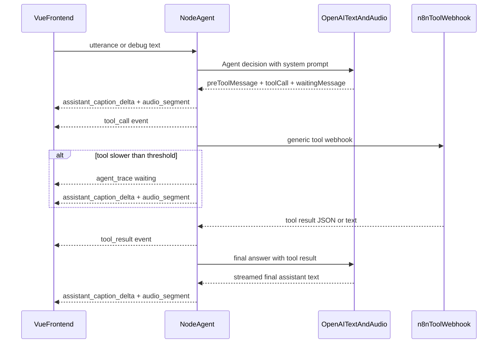

# Agent-Orchestrierung mit n8n-Tool und Hintergrund-Protokoll

## Zielbild

Die bisherige Pipeline `User Text -> n8n -> Phrase TTS -> Frontend` wird erweitert zu:



Damit kann die Middleware Sätze wie „Alles klar, gib mir einen Moment“ sofort sprechen, nach z. B. 4 Sekunden einen Wartehinweis sprechen und nach n8n-Ergebnis final antworten.

## Architekturänderungen

### 1. System Prompt und Agent-Konfiguration

In [`/home/ruf/projects/crm_support_call_demo/.env.example`](/home/ruf/projects/crm_support_call_demo/.env.example) und [`/home/ruf/projects/crm_support_call_demo/backend/src/config.ts`](/home/ruf/projects/crm_support_call_demo/backend/src/config.ts) ergänzen:

- `OPENAI_AGENT_MODEL`, z. B. `gpt-4.1-mini` oder aktuelles günstiges Textmodell
- `AGENT_SYSTEM_PROMPT`, mehrzeilig über escaped `\n` möglich
- `AGENT_WAITING_MESSAGE_AFTER_MS=4000`
- optional `AGENT_MAX_TOOL_CALLS=3`

Der Prompt steuert Tonalität, Tool-Nutzung und Zwischenantworten. Die Middleware bleibt aber verantwortlich für Timing, SSE-Events, Tool-Invocation und TTS.

### 2. Backend-Typen erweitern

In [`/home/ruf/projects/crm_support_call_demo/backend/src/types.ts`](/home/ruf/projects/crm_support_call_demo/backend/src/types.ts):

- `ChatRole` um `tool` oder separate `SessionTimelineItem` ergänzen
- Session-History aufteilen in:
  - `messages`: nutzbare Chat-History für den Agenten
  - `timeline`: sichtbares Protokoll für Frontend mit User, Assistant, Tool Call, Tool Result, Agent Note
- Neue SSE-Events:
  - `agent_trace` für sichtbare Arbeitsschritte wie „Tool wird vorbereitet“ oder „Warte auf n8n“
  - `tool_call` mit `toolCallId`, `toolName`, `arguments`
  - `tool_result` mit `toolCallId`, gekürztem/strukturiertem Result
  - bestehende Events `assistant_caption_delta`, `audio_segment`, `assistant_text_final`, `status` bleiben erhalten

Wichtig: Kein echtes Chain-of-Thought an das Frontend geben. Stattdessen nur kurze, vom System erzeugte oder vom Agenten als `visibleNote` gelieferte Arbeitsnotizen anzeigen.

### 3. Agent-Orchestrator einführen

Neues Backend-Modul [`/home/ruf/projects/crm_support_call_demo/backend/src/agentOrchestrator.ts`](/home/ruf/projects/crm_support_call_demo/backend/src/agentOrchestrator.ts):

- Nimmt `session`, `userText`, `AbortSignal`, SSE-Writer und Audio-Speaker entgegen
- Ruft OpenAI-Textmodell mit System Prompt und Session-History auf
- Nutzt ein strukturiertes Antwortformat für den ersten Agent-Schritt:
  - `shouldCallTool: boolean`
  - `spokenBeforeTool: string`
  - `toolName: string`
  - `toolArguments: object`
  - `spokenWhileWaiting: string`
  - `directAnswer: string`
- Wenn kein Tool nötig ist: `directAnswer` streamen/sprechen und abschließen
- Wenn Tool nötig ist:
  1. `spokenBeforeTool` sofort per bestehender Phrase/TTS/SSE-Logik ausgeben
  2. `tool_call` und `agent_trace` ans Frontend senden
  3. n8n-Tool aufrufen
  4. nach `AGENT_WAITING_MESSAGE_AFTER_MS`, wenn Tool noch läuft, `spokenWhileWaiting` ausgeben
  5. Tool-Result speichern und als `tool_result` senden
  6. Finalen OpenAI-Call mit Tool-Result starten und finalen Text streamen/sprechen

### 4. TTS-/Streaming-Code wiederverwendbar machen

Die aktuelle Logik in [`/home/ruf/projects/crm_support_call_demo/backend/src/pipeline.ts`](/home/ruf/projects/crm_support_call_demo/backend/src/pipeline.ts) enthält n8n-Streaming und Phrase-TTS vermischt. Sie wird aufgeteilt:

- `speakTextStream(textStream, res, signal)` für OpenAI-Finalantwort-Deltas
- `speakText(text, res, signal)` für Zwischenantworten wie `spokenBeforeTool` und `spokenWhileWaiting`
- beide nutzen weiterhin [`/home/ruf/projects/crm_support_call_demo/backend/src/phraseSegmenter.ts`](/home/ruf/projects/crm_support_call_demo/backend/src/phraseSegmenter.ts) und [`/home/ruf/projects/crm_support_call_demo/backend/src/openaiAudio.ts`](/home/ruf/projects/crm_support_call_demo/backend/src/openaiAudio.ts)

Dadurch bleibt das zentrale Streaming-Verhalten erhalten: Text wird sofort als Caption gezeigt, in Phrasen segmentiert, per TTS synthetisiert und als Audio-Segmente in Reihenfolge gesendet.

### 5. n8n als generisches Tool

[`/home/ruf/projects/crm_support_call_demo/backend/src/n8nClient.ts`](/home/ruf/projects/crm_support_call_demo/backend/src/n8nClient.ts) wird nicht mehr als Assistant-Antwortstream verstanden, sondern als Tool-Client erweitert oder durch `n8nToolClient.ts` ergänzt.

Payload an n8n:

```json
{
  "event": "tool_call",
  "sessionId": "...",
  "turnId": 3,
  "toolCallId": "...",
  "toolName": "lookup_invoice",
  "arguments": {},
  "userText": "...",
  "history": [],
  "timestamp": "..."
}
```

Response-Handling:

- JSON wie `{ "test": "success" }` wird als Tool-Result akzeptiert
- Plain Text wird ebenfalls akzeptiert
- Nicht-2xx erzeugt `tool_result` mit Fehlerstatus und eine agentische Fallback-Antwort
- n8n muss weiterhin keine Zwischenantworten liefern

### 6. Bestehende Endpunkte behalten

[`/home/ruf/projects/crm_support_call_demo/backend/src/index.ts`](/home/ruf/projects/crm_support_call_demo/backend/src/index.ts):

- `POST /api/sessions/:sessionId/utterance` bleibt: Audio -> STT -> Agent-Orchestrator
- `POST /api/sessions/:sessionId/debug-message` bleibt: Text -> Agent-Orchestrator ohne STT
- `interrupt` und `reset` bleiben, müssen aber zusätzlich laufende Agent-/Tool-Promises sauber abbrechen

### 7. Frontend: Hintergrund-Panel rechts außerhalb des Telefons

Aktuell sitzt [`/home/ruf/projects/crm_support_call_demo/frontend/src/components/TranscriptPanel.vue`](/home/ruf/projects/crm_support_call_demo/frontend/src/components/TranscriptPanel.vue) im Phone. Das wird geändert:

- Phone enthält nur Call-Erlebnis: Avatar, Status, Waveform, Controls
- Rechts neben dem Phone entsteht ein Panel „Das läuft im Hintergrund“
- Dieses Panel zeigt die Timeline:
  - Customer Message
  - Agent visible note
  - Assistant spoken message / streamed answer
  - Tool Call mit Name und Arguments
  - Tool Result mit JSON/Text-Auszug
  - Status/Errors

Änderungen in [`/home/ruf/projects/crm_support_call_demo/frontend/src/App.vue`](/home/ruf/projects/crm_support_call_demo/frontend/src/App.vue):

- `messages` zu `timelineItems` erweitern
- neue SSE-Events `agent_trace`, `tool_call`, `tool_result` verarbeiten
- `TranscriptPanel` außerhalb von `PhoneFrame` rendern
- bestehende Live-Caption-Logik für `assistant_caption_delta` behalten

Änderungen in [`/home/ruf/projects/crm_support_call_demo/frontend/src/styles/main.css`](/home/ruf/projects/crm_support_call_demo/frontend/src/styles/main.css):

- `.app-shell` von zentriertem Single-Phone zu zweispaltigem Layout erweitern
- rechte Spalte mit Glass-Panel, Scrollbereich, strukturierter Timeline
- Mobile: Panel unter dem Phone stapeln
- Debug-Menü bleibt fixed oben rechts im Browserfenster

### 8. Debug Mode anpassen

Debug-Buttons bleiben bestehen, sollen aber künftig Agent-/Tool-Verhalten testen:

- Preset „Ich brauche meine Rechnungsnummer“ hinzufügen
- Preset „Teste einen langsamen Tool Call“ hinzufügen
- Debug-Text geht an denselben Agent-Orchestrator wie Voice-STT-Text

### 9. Dokumentation aktualisieren

[`/home/ruf/projects/crm_support_call_demo/README.md`](/home/ruf/projects/crm_support_call_demo/README.md):

- Neue Agent-Architektur erklären
- System Prompt in `.env` dokumentieren
- n8n-Tool-Payload dokumentieren
- Hintergrund-Panel und sichtbare Tool-Events beschreiben
- Limitierung ergänzen: sichtbare „Gedanken“ sind keine privaten Chain-of-Thoughts, sondern kontrollierte Agent-Statusnotizen

## Akzeptanzkriterien

- System Prompt wird aus `.env` geladen
- Debug-Text und Voice-STT-Text nutzen dieselbe Agent-Orchestrierung
- Agent kann vor Tool-Call eine gesprochene Zwischenantwort ausgeben
- Wenn n8n länger als 4 Sekunden braucht, wird eine dynamische Warteantwort gesprochen
- Tool Call und Tool Result erscheinen rechts im Hintergrund-Panel
- Finalantwort wird nach Tool-Result generiert, gestreamt, phrase-segmentiert und gesprochen
- n8n bleibt extern und liefert nur Tool-Ergebnisse, keine Zwischenantworten
- Interrupt stoppt laufende TTS-Ausgabe, OpenAI-Agent-Calls und n8n-Tool-Calls so weit möglich
- Bestehende Audio-/Barge-in-Funktion bleibt erhalten
- `docker compose build` bleibt erfolgreich