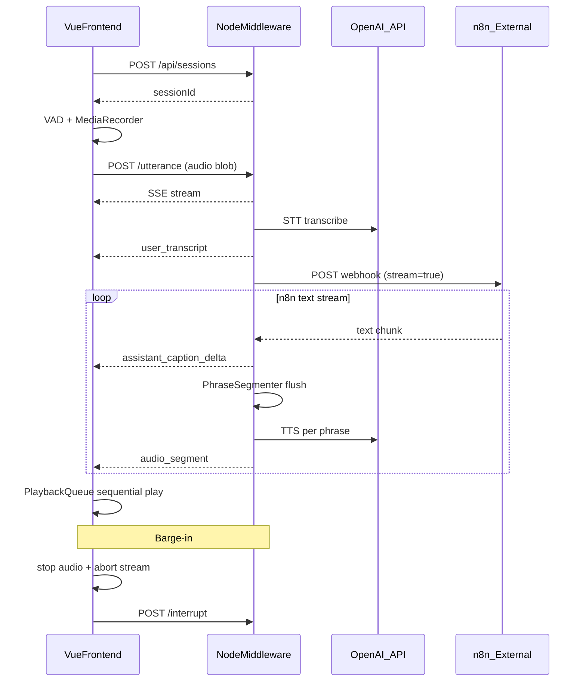
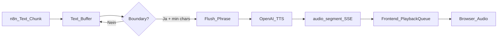

# Voice-Call Tech-Demo — Implementierungsplan

## Ausgangslage

Das Workspace [`/home/ruf/projects/crm_support_call_demo`](/home/ruf/projects/crm_support_call_demo) ist **leer**. Das gesamte Projekt wird gemäß der Spezifikation unter `voice-call-demo/` (bzw. direkt im Workspace-Root) neu aufgebaut.

## Architektur-Überblick



## Ziel-Verzeichnisstruktur

```
voice-call-demo/          (Workspace-Root)
├── docker-compose.yml
├── .env.example
├── README.md
├── backend/
│   ├── Dockerfile
│   ├── package.json
│   ├── tsconfig.json
│   └── src/
│       ├── index.ts          # Express-Server, Routen
│       ├── config.ts         # dotenv + zod-Validierung
│       ├── types.ts          # SessionState, ChatMessage, SSE-Events
│       ├── errors.ts         # AppError, HTTP-Mapping
│       ├── sessions.ts       # In-Memory Session-Store
│       ├── sse.ts            # SSE-Writer für POST-Responses
│       ├── openaiAudio.ts    # STT + TTS
│       ├── n8nClient.ts      # Streaming-Webhook-Client
│       └── phraseSegmenter.ts
└── frontend/
    ├── Dockerfile
    ├── nginx.conf
    ├── package.json
    ├── tsconfig.json
    ├── vite.config.ts
    ├── index.html
    └── src/
        ├── main.ts
        ├── App.vue           # CallState-Maschine, Orchestrierung
        ├── api/client.ts     # fetch + SSE-Parser
        ├── audio/
        │   ├── recorder.ts
        │   ├── vad.ts
        │   └── playbackQueue.ts
        ├── components/
        │   ├── PhoneFrame.vue
        │   ├── CallControls.vue
        │   ├── Waveform.vue
        │   ├── TranscriptPanel.vue
        │   └── StatusPill.vue
        └── styles/main.css
```

---

## Phase 1: Projekt-Scaffolding und Docker

### 1.1 Root-Konfiguration

- [`docker-compose.yml`](docker-compose.yml): Zwei Services `frontend` (Port `3000:80`) und `backend` (Port `3001:3001`), `.env`-Datei einbinden, `extra_hosts: ["host.docker.internal:host-gateway"]` für Linux-WSL-Kompatibilität.
- [`.env.example`](.env.example): Alle Variablen aus der Spezifikation (`OPENAI_API_KEY`, `N8N_WEBHOOK_URL`, `BACKEND_PORT`, `FRONTEND_ORIGIN`, STT/TTS-Modelle, Phrase-Parameter).
- [`.gitignore`](.gitignore): `node_modules`, `dist`, `.env`, Build-Artefakte.

### 1.2 Backend-Dockerfile

- Node LTS Alpine, `npm ci`, TypeScript-Build, `node dist/index.js`, Port `3001` exponieren.
- Multi-Stage optional: Build-Stage + schlanke Runtime-Stage.

### 1.3 Frontend-Dockerfile + nginx

- Build-Stage: `npm ci`, `vite build` mit `VITE_API_BASE=http://localhost:3001` als Build-Arg.
- Runtime: nginx Alpine, [`nginx.conf`](frontend/nginx.conf) mit SPA-Fallback (`try_files $uri /index.html`), Port `80`.

---

## Phase 2: Backend — Fundament

### 2.1 [`backend/package.json`](backend/package.json) und [`tsconfig.json`](backend/tsconfig.json)

Dependencies: `express`, `cors`, `dotenv`, `multer`, `openai`, `uuid`, `zod`. Dev: `typescript`, `@types/express`, `@types/multer`, `@types/cors`, `@types/uuid`, `tsx` (lokale Entwicklung).

### 2.2 [`backend/src/types.ts`](backend/src/types.ts)

Zentrale Typen definieren:

- `ChatMessage`, `SessionState` (inkl. `currentAbortController`, `interrupted`)
- SSE-Event-Typen: `status`, `user_transcript`, `assistant_caption_delta`, `audio_segment`, `assistant_text_final`, `error`
- Request/Response-DTOs für alle vier Endpunkte

### 2.3 [`backend/src/config.ts`](backend/src/config.ts)

- `dotenv.config()` laden
- Zod-Schema für alle Env-Variablen mit sinnvollen Defaults (`OPENAI_STT_MODEL`, `OPENAI_TTS_MODEL`, `PHRASE_*`)
- Exportiertes `config`-Objekt, frühzeitiger Abbruch bei fehlendem `OPENAI_API_KEY`

### 2.4 [`backend/src/errors.ts`](backend/src/errors.ts)

- `AppError` mit `code` und `statusCode`
- Hilfsfunktion `sendErrorEvent(res, message)` für SSE-Fehlerpfad
- Abort-Fehler still behandeln (kein Crash)

### 2.5 [`backend/src/sessions.ts`](backend/src/sessions.ts)

In-Memory `Map<string, SessionState>`:

- `createSession()` → neue UUID
- `getSession(id)` → 404 wenn nicht vorhanden
- `resetSession(oldId)` → alten AbortController abbrechen, neue Session erstellen
- `interruptSession(id)` → Controller aborten, `interrupted = true`
- `addMessage(session, role, content)`
- `incrementTurn(session)`

---

## Phase 3: Backend — Kernmodule

### 3.1 [`backend/src/phraseSegmenter.ts`](backend/src/phraseSegmenter.ts)

Klasse `PhraseSegmenter` mit internem Buffer:

| Flush-Trigger | Bedingung |
|---|---|
| Satzende | `.`, `?`, `!` |
| Newline | wenn `PHRASE_FLUSH_ON_NEWLINE=true` |
| Semikolon | nur wenn Buffer ≥ `PHRASE_MIN_CHARS` |
| Max-Länge | Buffer > `PHRASE_MAX_CHARS` |
| Stream-Ende | Rest-Buffer flushen (auch wenn < MIN) |

Methoden: `feed(chunk: string): string[]` (geflushte Phrasen), `flushRemaining(): string | null`.

### 3.2 [`backend/src/sse.ts`](backend/src/sse.ts)

- `initSseResponse(res)` — Header `Content-Type: text/event-stream`, `Cache-Control: no-cache`, `Connection: keep-alive`
- `writeEvent(res, event, data)` — Format `event: <name>\ndata: <json>\n\n`
- `closeSse(res)` — Verbindung sauber beenden

### 3.3 [`backend/src/openaiAudio.ts`](backend/src/openaiAudio.ts)

**`transcribeAudio(buffer, mimeType)`**
- OpenAI SDK, Modell aus Config
- File-Upload via `toFile()` oder Buffer-Stream
- Leere/fehlgeschlagene Transkripte → `AppError`
- Kein API-Key in Logs

**`synthesizeSpeech(text, signal?)`**
- Modell, Voice, Format aus Config
- Pro Phrase ein Request (sequenziell)
- Rückgabe `{ mimeType: "audio/mpeg", base64: "..." }`
- `AbortSignal` durchreichen für Interrupt

### 3.4 [`backend/src/n8nClient.ts`](backend/src/n8nClient.ts)

**`streamN8nResponse(payload, signal): AsyncGenerator<string>`**

Payload-Struktur gemäß Spec (`event`, `sessionId`, `turnId`, `userText`, `history`, `stream`, `timestamp`).

Response-Parser (Content-Type-Erkennung + Fallback):

1. **Plain text** — Chunk direkt als Text
2. **SSE** — `data:`-Zeilen parsen
3. **NDJSON** — Zeile für Zeile, Felder `delta|text|answer|response|message`
4. **JSON-Fallback** — Einmaliges Objekt mit `answer|response|text|message`

Wichtig: `response.body.getReader()` + `TextDecoder`, **niemals** `await response.text()` im Streaming-Pfad.

Bei Verbindungsfehler: Generator wirft spezifischen Fehler → Pipeline nutzt Fallback-Text.

---

## Phase 4: Backend — API und Pipeline

### 4.1 [`backend/src/index.ts`](backend/src/index.ts)

Express-Setup:
- `cors({ origin: config.FRONTEND_ORIGIN })`
- `express.json()` für JSON-Routen
- `multer.memoryStorage()` für Audio-Upload
- Health-Check `GET /health`

### 4.2 Endpunkte

| Route | Verhalten |
|---|---|
| `POST /api/sessions` | Neue Session, `{ sessionId }` |
| `POST /api/sessions/:id/reset` | Abort + neue Session-ID |
| `POST /api/sessions/:id/interrupt` | AbortController aborten, `{ ok: true }` |
| `POST /api/sessions/:id/utterance` | Multipart `audio`, optional `clientTurnId` → SSE-Stream |

### 4.3 Utterance-Pipeline (Kernlogik in `index.ts` oder dediziertem Handler)

```
1. Session validieren
2. Neuen AbortController an Session hängen
3. SSE status: transcribing
4. transcribeAudio()
5. SSE user_transcript + History speichern
6. SSE status: thinking
7. n8n stream starten
   Für jeden Text-Chunk:
     - assistant_caption_delta senden
     - PhraseSegmenter.feed()
     - Für jede Phrase:
         - status: speaking
         - synthesizeSpeech()
         - audio_segment senden (sequence hochzählen)
8. Stream-Ende: flushRemaining → letztes TTS
9. assistant_text_final + History
10. status: done, SSE schließen
```

**Interrupt-Pfad:** Bei `signal.aborted` → `status: interrupted`, sauber beenden.

**n8n-Fallback:** Bei Fehler → festen Text synthetisieren und senden.

**Concurrency:** TTS sequenziell pro Phrase (einfach, geordnet).

---

## Phase 5: Frontend — Scaffolding

### 5.1 Vite + Vue 3 Setup

- [`frontend/package.json`](frontend/package.json): `vue`, `vite`, `@vitejs/plugin-vue`, `typescript`, `vue-tsc`
- [`vite.config.ts`](frontend/vite.config.ts): Vue-Plugin, `import.meta.env.VITE_API_BASE`
- [`index.html`](frontend/index.html), [`src/main.ts`](frontend/src/main.ts) mit globalem CSS-Import

### 5.2 [`frontend/src/api/client.ts`](frontend/src/api/client.ts)

Funktionen:
- `createSession()`, `resetSession(id)`, `interruptSession(id)`
- `sendUtterance(sessionId, audioBlob, clientTurnId, onEvent, signal)` — `fetch` POST mit `FormData`, `response.body.getReader()` für SSE-Parsing aus POST-Response (kein EventSource)

SSE-Parser: Zeilenweise `event:` / `data:` parsen, Callback pro Event-Typ.

---

## Phase 6: Frontend — Audio-Subsystem

### 6.1 [`frontend/src/audio/vad.ts`](frontend/src/vad.ts)

RMS-basierte VAD über `AnalyserNode`:
- Konstanten: `SPEECH_THRESHOLD`, `SPEECH_START_MS = 200`, `SPEECH_END_MS = 900`
- `onSpeechStart()` / `onSpeechEnd()` Callbacks
- Läuft parallel zur Wiedergabe (Barge-in-Erkennung)

### 6.2 [`frontend/src/audio/recorder.ts`](frontend/src/audio/recorder.ts)

- `getUserMedia` mit Echo-Cancellation/Noise-Suppression/AGC
- `MediaRecorder` mit `audio/webm;codecs=opus` (Fallback prüfen)
- `AudioContext` + `AnalyserNode` für VAD + Waveform-Daten
- Ein Utterance pro Aufnahme-Zyklus
- `startListening()` / `stop()` / `getAudioBlob()`

### 6.3 [`frontend/src/audio/playbackQueue.ts`](frontend/src/audio/playbackQueue.ts)

- Queue von `{ sequence, blobUrl }`
- Sequenzielles Abspielen via `HTMLAudioElement` (kein Overlap)
- `enqueue(base64, mimeType, sequence)`
- `clear()` bei Interrupt/Reset
- `onPlaybackStart` / `onPlaybackEnd` / `onQueueEmpty` Callbacks
- Base64 → Blob → Object URL

---

## Phase 7: Frontend — UI-Komponenten

### 7.1 Design-System [`frontend/src/styles/main.css`](frontend/src/styles/main.css)

- Dunkler Premium-Hintergrund (`#0a0a0f` o.ä.)
- Glassmorphism für Phone-Frame
- CSS-Variablen für Farben, Radii, Transitions
- User-Nachrichten rechts, Assistant links
- Responsive zentriert

### 7.2 Komponenten

| Komponente | Verantwortung |
|---|---|
| [`PhoneFrame.vue`](frontend/src/components/PhoneFrame.vue) | Smartphone-Rahmen, Notch/Dynamic Island, Avatar, Name, Session-ID |
| [`Waveform.vue`](frontend/src/components/Waveform.vue) | Animierter Orb/Waveform — unterschiedliche Animation für `listening` vs `speaking` |
| [`CallControls.vue`](frontend/src/components/CallControls.vue) | Grüner Start-Button, roter Interrupt, Reset |
| [`StatusPill.vue`](frontend/src/components/StatusPill.vue) | Aktueller `CallState` als Pill |
| [`TranscriptPanel.vue`](frontend/src/components/TranscriptPanel.vue) | Chat-Drawer mit User/Assistant-Nachrichten + Live-Caption |

### 7.3 [`frontend/src/App.vue`](frontend/src/App.vue) — State Machine

```typescript
type CallState =
  | "idle" | "listening" | "recording" | "transcribing"
  | "thinking" | "speaking" | "interrupted" | "error";
```

Orchestrierung:
- Grün → Session erstellen → Mikrofon + VAD starten
- VAD Speech-End → Blob senden → SSE-Events verarbeiten
- `audio_segment` → PlaybackQueue
- Queue leer → zurück zu `listening`
- Rot → sofortiger Barge-in-Flow (siehe unten)
- Reset → Stream aborten, Queue leeren, neue Session

### 7.4 Barge-in-Flow (kritisch)

Bei `onSpeechStart` während `speaking`:
1. `playbackQueue.clear()` + aktuelles Audio stoppen
2. Aktiven `AbortController` für SSE abbrechen
3. `POST /api/sessions/:id/interrupt`
4. State → `recording`
5. Neue Utterance aufnehmen

---

## Phase 8: Dokumentation und Abschluss

### 8.1 [`README.md`](README.md)

Inhalt gemäß Spec:
1. `.env.example` → `.env` kopieren
2. `OPENAI_API_KEY` setzen
3. `N8N_WEBHOOK_URL` konfigurieren
4. n8n separat starten + Webhook einrichten (POST, Path `voice-assistant`, Streaming)
5. `docker compose up --build`
6. Browser: `http://localhost:3000`

Erklärungen:
- Warum n8n extern ist
- `host.docker.internal` unter Linux/WSL
- Phrase-Level-TTS-Pipeline (Diagramm)
- Warum nicht jeder Text-Delta direkt an TTS geht
- Bekannte Limitierungen (kein WebRTC, utterance-basiertes STT, phrase-basiertes TTS, app-level Interrupt)

---

## Datenfluss: Phrase-Segmentierung (Detail)



**Warum nicht Delta → TTS direkt?** Viele kleine TTS-Requests erzeugen abgehackte Sprache, hohe Latenz und API-Kosten. Phrase-Level gibt natürliche Pausen und Streaming-Gefühl ohne Full-Realtime-Architektur.

---

## Akzeptanzkriterien (Checkliste)

1. `docker compose up --build` startet Frontend + Backend
2. Frontend unter `http://localhost:3000`, Backend unter `http://localhost:3001`
3. Smartphone-Call-UI ist demo-ready
4. Grün startet Listening, Rot unterbricht, Reset startet neu
5. Utterance-Aufnahme → STT → n8n → phrase-TTS → sequenzielles Abspielen
6. Live-Captions während n8n streamt
7. Barge-in stoppt Audio sofort
8. Kein OpenAI-Key im Frontend
9. n8n nicht im Docker-Stack
10. Typisierter, wartbarer Code

---

## Implementierungsreihenfolge (empfohlen)

Backend zuerst (API testbar mit curl), dann Frontend-Audio, dann UI, dann Integration. Docker-Setup parallel am Anfang, damit früh `docker compose up` funktioniert.

## Bekannte Risiken

| Risiko | Mitigation |
|---|---|
| WSL2 `host.docker.internal` | `extra_hosts` in compose; in README alternativ `172.17.0.1` dokumentieren |
| n8n liefert kein Streaming | JSON-Fallback-Parser; README mit n8n-Webhook-Konfiguration |
| Browser blockiert Mikrofon ohne HTTPS | Lokal über `localhost` OK; in README erwähnen |
| WebM-Codec nicht unterstützt | Fallback-MIME in MediaRecorder prüfen |
